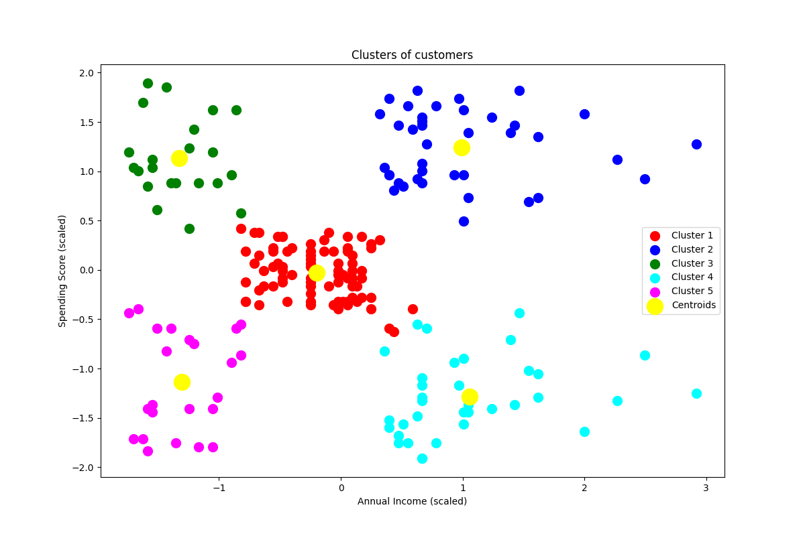
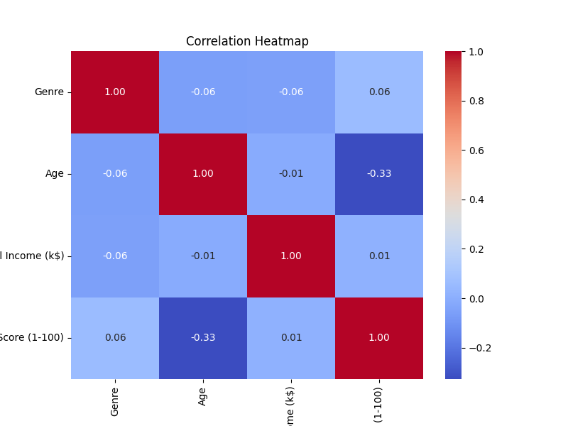
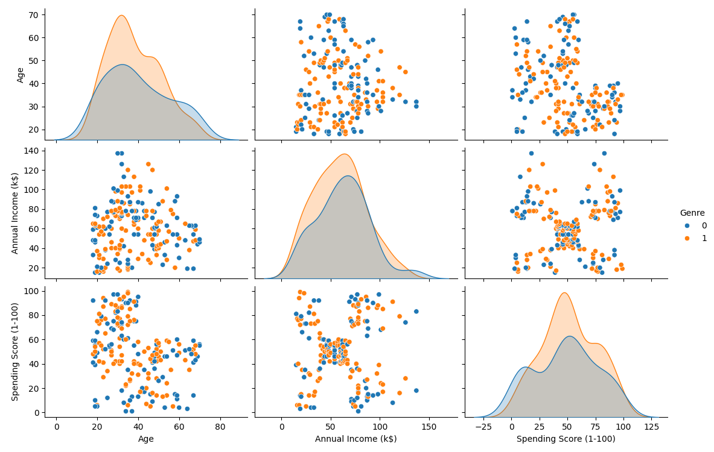
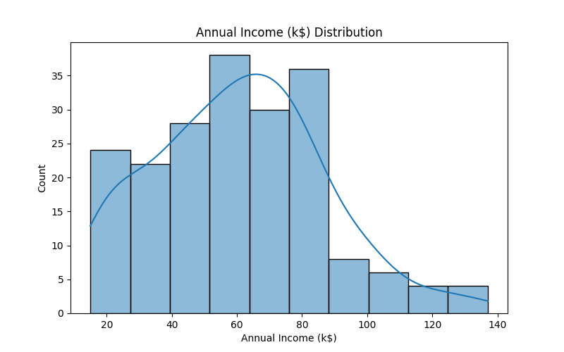

# Intelligent Customer Segmentation

> End-to-end customer intelligence platform using unsupervised machine learning to discover customer segments, generate data-driven personas, evaluate clustering strategies, and translate analytical findings into actionable business insights.

## What it is

An applied machine-learning project that turns raw customer records into a usable segmentation strategy. A reproducible `src/` pipeline loads and validates the data, preprocesses it, runs four unsupervised clustering algorithms, scores each configuration with standard metrics, selects the best strategy, and maps every cluster to a named business persona with concrete recommendations. A Streamlit dashboard exposes the whole analysis interactively, and a trained model predicts the segment of any new customer without retraining.

## Why it matters

One-size-fits-all campaigns waste budget and miss high-value opportunities. By discovering segments empirically and attaching data-driven personas and strategies, this project gives marketing, product, and retention teams a defensible, evidence-based view of their customer base — plus a reusable workflow they can point at larger datasets.

## Technologies

`Python` · `scikit-learn` · `pandas` · `numpy` · `Streamlit` · `Plotly` · `joblib` · `pytest`

## Dashboard

An interactive **seven-tab Streamlit dashboard** (`app.py`) is included and runs locally with `streamlit run app.py`. It covers an executive overview, customer analytics, a clustering lab, model comparison, a segment explorer, new-customer prediction, and exports.

## Key capabilities

- **Four clustering algorithms** — K-Means, Agglomerative, DBSCAN, and Gaussian Mixture Models behind a single dispatcher.
- **Reproducible preprocessing** — deduplication, missing-value imputation, encoding, and `StandardScaler` via a `ColumnTransformer`.
- **Multi-metric evaluation** — Silhouette, Calinski-Harabasz, Davies-Bouldin, and Inertia, with a composite score that recommends the best configuration.
- **Data-driven personas** — five business personas derived from cluster centers and dataset quartiles, each with strategy and recommendations.
- **Analytical depth** — segment-vs-overall comparison (Cohen's d), ANOVA feature separation, and K-Means stability (ARI).
- **Prediction** — assign a new customer to the nearest centroid and return persona + strategy, with no retraining.
- **Export** — CSV and TXT artefacts for segmented customers, summaries, evaluation, and insights.
- **Tests** — 199 automated pytest cases across the full pipeline.

### Architecture

```mermaid
flowchart LR
    A[Customer Data CSV] --> B[Data Loader]
    B --> C[Validation]
    C --> D[Preprocessing]
    D --> E[Clustering Engine]
    E --> F[Evaluation]
    F --> G[Model Selection]
    G --> H[Persona Assignment]
    H --> I[Business Insights]
    I --> J[Streamlit Dashboard]
    J --> K[Export / Prediction]
```



### Machine Learning Pipeline

The pipeline follows a linear, reproducible flow:

```text
Data
→ Validation
→ Preprocessing
→ Clustering
→ Evaluation
→ Model Selection
→ Personas
→ Business Insights
→ Prediction
```

1. **Data** — loads `Mall_Customers.csv` (200 rows, 5 columns) via `src/data_loader.py`.
2. **Validation** — checks file existence, empty rows, required columns, and dtype schema.
3. **Preprocessing** — deduplicates, imputes missing values, one-hot encodes `Genre`, and scales numerics with `StandardScaler` via `ColumnTransformer`.
4. **Clustering** — fits the selected algorithm (K-Means, Agglomerative, DBSCAN, or GMM) and returns labels and cluster centers.
5. **Evaluation** — computes applicable metrics: Silhouette Score, Calinski-Harabasz Index, Davies-Bouldin Index, and Inertia (K-Means only).
6. **Model Selection** — normalizes metrics to [0,1], averages available scores, and ranks candidates to recommend the best configuration for the dataset.
7. **Personas** — maps each cluster center to a persona using income/spending quartile breakpoints derived from the full dataset.
8. **Business Insights** — generates per-persona interpretations, opportunities, marketing strategies, and retention recommendations.
9. **Prediction** — assigns a new customer to the nearest cluster centroid and returns the corresponding persona and strategy.

### Algorithms

* **K-Means** — partitions customers into a fixed number of spherical, equally sized groups by iteratively moving centroids to minimize within-cluster sum of squares. Fast and easy to explain. Best when segments are roughly round and similarly dense. The default and reference algorithm for elbow/silhouette analysis.

* **Agglomerative Clustering** — starts with each customer as its own group and repeatedly merges the closest pairs. The linkage method controls how "closeness" is measured, which shapes the final segment geometry. Useful when you need a hierarchy of merges or when non-spherical segment shapes are expected.

* **DBSCAN** — discovers dense regions of customers and marks sparse areas as noise instead of forcing every customer into a segment. Does not require a fixed number of segments. Sensitive to `eps` and `min_samples`; most useful when the data contains natural density variations or outliers.

* **Gaussian Mixture Model (GMM)** — fits overlapping bell-shaped distributions and assigns each customer a probability of belonging to each segment. Captures softer, overlapping membership better than K-Means. Useful when segment boundaries are ambiguous and probabilistic assignment is preferred.

### Evaluation Metrics

* **Silhouette Score** — compares each customer's distance to its own segment center against its distance to the next nearest center. Ranges from -1 (overlapping) to 1 (perfectly distinct). Higher is better. Requires at least two clusters. Values above ~0.5 indicate reasonably separated segments.

* **Davies-Bouldin Index** — measures the average "similarity" between each segment and its most similar neighboring segment, where similarity combines spread and separation. Lower is better. A value of 0 would indicate perfectly compact and well-separated segments.

* **Calinski-Harabasz Index** — the ratio of between-segment dispersion to within-segment dispersion. Higher is better. There is no fixed upper bound, so it is interpreted relative to other configurations on the same dataset.

* **Inertia (WCSS)** — the sum of squared distances from each customer to its assigned segment center. K-Means only. Lower means customers sit closer to their center. It always decreases as the number of segments increases, so it is used for the "elbow" shape rather than for direct comparison across different k values.

### Dataset

The project uses the **Mall Customers** dataset (`data/Mall_Customers.csv`), a small, clean dataset commonly used for segmentation demos.

| Property | Value |
|----------|-------|
| Rows | 200 |
| Columns | 5 |
| Missing values | 0 |
| Duplicates | 0 |

| Column | Type | Description |
|--------|------|-------------|
| `CustomerID` | integer | Unique customer identifier |
| `Genre` | categorical | Gender (`Male` or `Female`) |
| `Age` | integer | Customer age (18–70) |
| `Annual Income (k$)` | integer | Annual income in thousands of dollars |
| `Spending Score (1-100)` | integer | Mall-assigned spending behavior score |

The default clustering features are `Annual Income (k$)` and `Spending Score (1-100)`. `Genre` and `Age` are available for analytics and visualization but are not used as clustering inputs in the default configuration.

### Customer Personas

Personas are generated deterministically from cluster characteristics:

1. Cluster centers are inverse-transformed from the scaled feature space back to the original scale.
2. Quartile breakpoints (25th and 75th percentiles) are computed from the full dataset's `Annual Income (k$)` and `Spending Score (1-100)`.
3. Each cluster center is classified as low, mid, or high on income and spending using those breakpoints.
4. A fixed mapping assigns one of five personas: High-Value Customers, Premium Savers, Budget-Conscious Spenders, Low-Engagement Customers, or Growth Opportunity Customers.
5. Each persona includes a profile summary (count, percentage, averages, key characteristics) and a business strategy.

### Dashboard

The Streamlit app (`app.py`) is organized into seven tabs:

1. **Executive Overview** — KPI cards for total customers, segments, average income, average spending, selected model, configuration, and silhouette score. Includes a headline business insight and a list of analytical insights.

2. **Customer Analytics** — interactive Plotly histograms of Age, Annual Income, and Spending Score distributions; a donut chart for gender composition; a correlation heatmap for the three numeric features; scatter plots of Income vs. Spending colored by gender or by segment; and a 3D scatter view of all numeric features.

3. **Clustering Lab** — algorithm selector, parameter controls (k, linkage, eps, min_samples), Apply Configuration button, cluster scatter plot with centroids, per-segment size bar chart, model metrics table, segment centers on the original scale, and a Retrain & Save button for the prediction model. Includes an interpretation panel explaining the algorithm and reading the silhouette score.

4. **Model Comparison** — a predefined suite of candidate configurations is evaluated and displayed in a comparison table with Silhouette, Calinski-Harabasz, Davies-Bouldin, and Inertia. Includes a recommended configuration based on the composite ranking. Also shows K-Means cluster stability (mean/min/max/std ARI across 10 runs) and a dual-axis elbow/silhouette chart for k = 2..10.

5. **Segment Explorer** — persona overview cards sorted by size, a detail panel with profile summary and key characteristics, recommended action and strategy, business recommendations (interpretation, opportunity, marketing strategy, retention), segment-vs-overall standardized differences, and feature separation analysis (ANOVA F-ratios).

6. **New Customer Prediction** — form to enter Age, Gender, Annual Income, and Spending Score. The app maps the input to the nearest cluster centroid, assigns the corresponding persona, and displays the persona description, strategy, and business recommendations. The model is loaded once via joblib and reused; form submission does not retrain.

7. **Export** — download segmented customers CSV, segment summary CSV, model evaluation CSV, and a plain-text cluster insights report.

### Model Prediction

The inference pipeline is:

1. A prediction bundle (preprocessor, scaled centers, original-scale centers, personas, algorithm, config, model version) is trained and persisted to `models/segmentation_model.joblib` using joblib.
2. On app load, the bundle is loaded (or trained if missing / version-mismatched) and cached with `@st.cache_resource`.
3. When a user submits the prediction form, the input row is transformed with the saved preprocessor.
4. The Euclidean distance to each valid cluster center is computed.
5. The nearest center's cluster ID is mapped to its persona.
6. The persona name, description, strategy, and business recommendations are returned to the UI.

### Export

Four downloadable artefacts are available in the Export tab:

- **customer_segmentation_results.csv** — every customer with their assigned segment for the active configuration.
- **segment_summary.csv** — one row per segment with size, percentage, profile summary, key characteristics, and recommended strategy.
- **model_evaluation.csv** — metric scores (Silhouette, Calinski-Harabasz, Davies-Bouldin, Inertia) for every candidate algorithm and configuration.
- **cluster_insights_report.txt** — plain-text narrative of every segment, its size, characteristics, and business strategy.

### Sample Visualizations

Example exploratory visualizations of the customer dataset (static; the live dashboard renders interactive Plotly charts):

| Cluster segmentation | Income / spending correlation |
|---|---|
|  |  |

| Feature distributions (pair plot) | Annual income distribution |
|---|---|
|  |  |

### Testing

```bash
python -m pytest
```

Current result: **199 passed, 6 warnings** in ~9s. Coverage is reported via pytest-cov.

### Installation

```bash
git clone https://github.com/ARJUN-0402/Intelligent-Customer-Segmentation.git
cd Intelligent-Customer-Segmentation
pip install -r requirements.txt
```

### Usage

```bash
streamlit run app.py
```

The app opens at `http://localhost:8501`.

### Project Structure

```text
Intelligent-Customer-Segmentation/
├── app.py
├── requirements.txt
├── README.md
├── LICENSE
├── .gitignore
├── data/
│   └── Mall_Customers.csv
├── src/
│   ├── __init__.py
│   ├── utils.py
│   ├── data_loader.py
│   ├── preprocessing.py
│   ├── clustering.py
│   ├── evaluation.py
│   ├── personas.py
│   ├── business_insights.py
│   └── analytics.py
├── tests/
│   ├── conftest.py
│   ├── test_data_loader.py
│   ├── test_preprocessing.py
│   ├── test_clustering.py
│   ├── test_evaluation.py
│   ├── test_personas.py
│   ├── test_business_insights.py
│   ├── test_prediction.py
│   └── test_analytics.py
├── models/
│   └── segmentation_model.joblib
├── outputs/
│   ├── customers_clustered.csv
│   ├── cluster_profiles.csv
│   ├── evaluation_results.csv
│   ├── segmentation_report.txt
│   └── figures/
└── docs/
    ├── PROJECT_AUDIT.md
    ├── README_AUDIT.md
    └── CURRENT_STATE.md
```

### Limitations

* The dataset is relatively small (200 customers) and low-dimensional (2 primary features for clustering). Results may not generalize to larger or more complex retail datasets.
* Clustering quality depends heavily on the chosen features. The default pipeline uses only Income and Spending Score; adding Age, Gender, or RFM-style features could change segment structures.
* Segmentation is descriptive, not causal. The personas and recommendations reflect correlations in the data, not proven causal effects.
* Business recommendations are analytical suggestions based on cluster statistics, not validated marketing plans.
* DBSCAN performance is sensitive to `eps` and `min_samples` and may produce no valid clusters with default settings on this dataset.
* Model selection uses a dataset-specific composite score, which does not guarantee optimality on unseen data.
* The prediction model assigns customers by nearest centroid distance, which assumes spherical, equally sized clusters (a K-Means assumption).

### Future Improvements

The following are not currently implemented:

* RFM (Recency, Frequency, Monetary) segmentation for transactional datasets
* Customer Lifetime Value (CLV) prediction
* Churn prediction using supervised learning
* Product recommendation systems based on segment affinity
* Campaign response prediction
* Database integration for live data refresh
* Dimensionality reduction (PCA / t-SNE) for high-dimensional visualizations
* Hyperparameter optimization (Optuna or GridSearchCV)
* A/B testing framework for segment-level campaign comparison
* API layer (FastAPI / Flask) for downstream system integration
* Docker containerization and CI/CD pipeline
