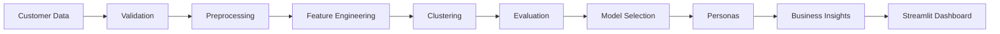

# Intelligent Customer Segmentation

An end-to-end machine learning platform for customer segmentation, clustering evaluation, persona generation, and business insight delivery. The project combines a reusable scikit-learn pipeline with an interactive Streamlit dashboard.

## Description

This project segments customers into interpretable groups using multiple clustering algorithms, evaluates them with standard unsupervised metrics, maps each cluster to a named persona, and surfaces actionable business recommendations through a web dashboard. All ML logic is isolated in reusable `src/` modules; the Streamlit app (`app.py`) is a thin presentation layer that loads data, runs clustering, evaluates models, assigns personas, and enables new-customer prediction without retraining.

## Features

- **Modular ML pipeline** — loading, validation, preprocessing, clustering, evaluation, persona assignment, and business insights are each isolated in `src/` modules with no duplication in the dashboard.
- **Multiple clustering algorithms** — K-Means, Agglomerative Clustering, DBSCAN, and Gaussian Mixture Model (GMM) through a unified `run_clustering` dispatcher.
- **Standardized preprocessing** — duplicate removal, missing-value imputation, one-hot encoding of categoricals, and `StandardScaler` normalization of numerics via a single reusable `ColumnTransformer` pipeline.
- **Multi-metric evaluation** — Silhouette Score, Calinski-Harabasz Index, Davies-Bouldin Index, and K-Means Inertia. Metrics are only computed when meaningful for the algorithm and cluster count.
- **Automated model selection** — candidate configurations are ranked by a dataset-specific composite of normalized metrics, producing a recommended configuration.
- **Persona generation** — each cluster is mapped to one of five business personas using income/spending quartile breakpoints derived from the full dataset.
- **Business insights** — every persona includes a business interpretation, opportunity, recommended marketing strategy, and retention/engagement recommendation.
- **Interactive dashboard** — seven Streamlit sections for executive KPIs, exploratory analytics, clustering experimentation, model comparison, segment drill-down, new-customer prediction, and CSV export.
- **Persistent prediction model** — the active segmentation model is serialized with `joblib` so the prediction form assigns new customers to segments without retraining.
- **Validation and testing** — 143 pytest cases covering data loading, preprocessing, clustering algorithms, evaluation, personas, business insights, and the prediction pipeline.

## Business Problem

Customer segmentation groups a customer base into distinct segments with shared characteristics. Without segmentation, marketing, product, and retention teams rely on one-size-fits-all campaigns that waste budget on irrelevant offers and miss high-value opportunities. By identifying groups such as high-income high-spending VIPs, high-income low-spending savers, and low-income high-spending impulsive buyers, businesses can:

- tailor promotions and product recommendations to each segment,
- allocate marketing budget toward the most profitable groups,
- design retention strategies for at-risk or high-potential segments,
- and measure campaign effectiveness against well-defined customer profiles.

## Technical Architecture



## Machine Learning

### Algorithms

| Algorithm | Implementation | Key Parameters |
|-----------|---------------|----------------|
| **K-Means** | `sklearn.cluster.KMeans` | `n_clusters`, `n_init=10`, `k-means++` init |
| **Agglomerative Clustering** | `sklearn.cluster.AgglomerativeClustering` | `n_clusters`, `linkage` (ward, complete, average, single) |
| **DBSCAN** | `sklearn.cluster.DBSCAN` | `eps`, `min_samples`, euclidean metric |
| **Gaussian Mixture Model** | `sklearn.mixture.GaussianMixture` | `n_components`, `covariance_type` |

All algorithms are wrapped in a `ClusterResult` dataclass that exposes `labels`, `cluster_centers`, `n_clusters`, `inertia` (K-Means only), `noise_points` (DBSCAN only), `bic`/`aic` (GMM only), and a `valid` flag.

### Feature Scaling

Numeric features (`Annual Income (k$)` and `Spending Score (1-100)`) are standardized with `StandardScaler` inside a scikit-learn `ColumnTransformer`. Categorical features (`Genre`) are one-hot encoded when included. The preprocessor supports inverse-transforming cluster centers back to the original scale for business-readable reporting.

### Evaluation Metrics

- **Silhouette Score** — measures cluster cohesion vs. separation. Higher is better. Requires at least two clusters.
- **Calinski-Harabasz Index** — ratio of between-cluster dispersion to within-cluster dispersion. Higher is better.
- **Davies-Bouldin Index** — average similarity of each cluster to its most similar cluster. Lower is better.
- **Inertia (WCSS)** — sum of squared distances to the nearest cluster center. K-Means only; lower is better.

### Model Selection

The `select_best_clustering_model` function evaluates a list of candidate configurations, normalizes each metric to `[0, 1]` (reversing lower-is-better metrics), averages the available normalized scores per model, and ranks candidates by composite score. Ties are broken alphabetically by algorithm name. The recommended configuration is surfaced in the dashboard.

## Dataset

The project uses the **Mall Customers** dataset, included as `data/Mall_Customers.csv`. It contains **200 rows** and **5 columns**:

| Column | Type | Description |
|--------|------|-------------|
| `CustomerID` | integer | Unique customer identifier |
| `Genre` | categorical | Gender (`Male` or `Female`) |
| `Age` | integer | Customer age |
| `Annual Income (k$)` | integer | Annual income in thousands of dollars |
| `Spending Score (1-100)` | integer | Score assigned by the mall based on customer behavior and spending nature |

The dataset has no missing values. The default clustering uses `Annual Income (k$)` and `Spending Score (1-100)`.

## Results

The optimal number of clusters for this dataset is **k = 5**, selected by the highest silhouette score across `k = 2..10`.

| Cluster | Persona | Customers | Avg Income | Avg Spending | Top Genre |
|---------|---------|-----------|------------|--------------|-----------|
| 0 | Mainstream Shoppers | 81 | 55.3k | 49.5 | Female |
| 1 | High-Value Customers | 39 | 86.5k | 82.1 | Female |
| 2 | Budget-Conscious Spenders | 22 | 25.7k | 79.4 | Female |
| 3 | Premium Savers | 35 | 88.2k | 17.1 | Male |
| 4 | Low-Engagement Customers | 23 | 26.3k | 20.9 | Female |

Best silhouette score: **0.5547**.

## Dashboard

The Streamlit dashboard (`app.py`) is organized into seven tabs:

1. **Executive Overview** — KPI cards showing total customers, cluster count, average income, average spending score, selected algorithm, configuration, and silhouette score.
2. **Customer Analytics** — interactive Plotly histograms of Age, Annual Income, and Spending Score distributions; a gender distribution pie chart; a feature correlation heatmap; and scatter plots of Income vs. Spending Score colored by gender or by cluster.
3. **Clustering Lab** — choose an algorithm (K-Means, Agglomerative, DBSCAN, GMM), tune parameters, apply the configuration, and visualize the resulting clusters with centroids, cluster size bar chart, model metrics table, and cluster centers on the original scale. Includes a button to retrain and save the prediction model.
4. **Model Comparison** — a predefined suite of candidate configurations is evaluated and displayed in a comparison table with a recommendation based on the composite metric ranking. Includes an interactive dual-axis line chart of K-Means inertia and silhouette score across `k = 2..10`, with the optimal `k` annotated.
5. **Segment Explorer** — select a cluster/persona to view its name, description, segment size, percentage of the base, average income, average spending score, profile summary, key characteristics, and business recommendations (interpretation, opportunity, marketing strategy, retention/engagement).
6. **New Customer Prediction** — enter Age, Gender, Annual Income, and Spending Score. The app maps the input to the nearest cluster centroid, assigns the corresponding persona, and displays tailored business recommendations. The model is loaded once via `joblib` and reused; form submission does not retrain.
7. **Export** — download segmented customers CSV, segment summary CSV, model comparison CSV, and a cluster insights text report.

## Installation

```bash
git clone https://github.com/ARJUN-0402/Intelligent-Customer-Segmentation.git
cd Intelligent-Customer-Segmentation
pip install -r requirements.txt
```

## Usage

```bash
python -m streamlit run app.py
```

The app opens at `http://localhost:8501`.

## Testing

```bash
pytest
```

## Project Structure

```text
Intelligent-Customer-Segmentation/
├── app.py                        # Streamlit dashboard
├── requirements.txt              # Python dependencies
├── README.md                     # This file
├── LICENSE                       # MIT License
├── .gitignore
│
├── data/
│   └── Mall_Customers.csv        # Source dataset (200 rows x 5 columns)
│
├── src/
│   ├── __init__.py
│   ├── utils.py                  # Constants, portable paths, helpers
│   ├── data_loader.py            # Dataset loading + validation
│   ├── preprocessing.py          # Cleaning, encoding, scaling pipeline
│   ├── clustering.py             # K-Means, Agglomerative, DBSCAN, GMM
│   ├── evaluation.py             # Multi-metric comparison + model selection
│   ├── personas.py               # Cluster-to-persona mapping + profiles
│   └── business_insights.py      # Business insight generation + reports
│
├── tests/
│   ├── conftest.py               # Shared pytest fixtures
│   ├── test_data_loader.py
│   ├── test_preprocessing.py
│   ├── test_clustering.py
│   ├── test_evaluation.py
│   ├── test_personas.py
│   ├── test_business_insights.py
│   └── test_prediction.py
│
├── models/
│   └── segmentation_model.joblib # Serialized prediction model
│
├── outputs/
│   ├── customers_clustered.csv
│   ├── cluster_profiles.csv
│   ├── evaluation_results.csv
│   ├── segmentation_report.txt
│   └── figures/
│       ├── elbow_method.png
│       ├── customer_clusters.png
│       └── silhouette_scores.png
│
├── assets/                       # Historical analysis images and archive
└── docs/                         # Documentation and audit reports
```

## Deployment

This project is compatible with **Streamlit Community Cloud**, **Streamlit in Enterprise**, or any environment that can run Python and expose port 8501.

To deploy on Streamlit Community Cloud:

1. Push this repository to GitHub.
2. Connect the repo at [share.streamlit.io](https://share.streamlit.io).
3. Set the main file to `app.py` and the Python version to `3.9+` (or your preferred supported version).
4. Deploy. Streamlit installs dependencies from `requirements.txt` automatically.

## Future Improvements

The following ideas are not currently implemented and are listed as potential extensions:

- **RFM segmentation** — incorporate Recency, Frequency, and Monetary features for transactional datasets.
- **CLV prediction** — predict customer lifetime value using regression or survival models.
- **Churn prediction** — classify customers as likely to churn using supervised learning.
- **Recommendation systems** — suggest products or offers based on segment affinity and collaborative filtering.
- **Campaign response prediction** — estimate the probability a customer will respond to a specific campaign.
- **Database integration** — connect to a live database (PostgreSQL, MySQL, etc.) for real-time segmentation and automated refresh.
- **Dimensionality reduction** — add PCA or t-SNE visualizations for high-dimensional feature spaces.
- **Hyperparameter optimization** — integrate Optuna or scikit-learn's `GridSearchCV` for automated tuning.
- **A/B testing framework** — compare segment-level campaign performance with statistical significance testing.
- **API layer** — expose segmentation and prediction endpoints via FastAPI or Flask for downstream system integration.

## License

MIT — see `LICENSE` for details.
